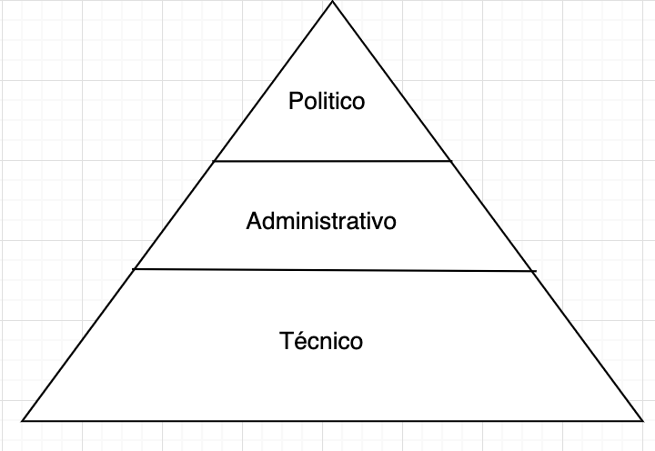

# Diseño de organizaciones
(*Mitzberg*)

## Definición

La estructura de una organización puede ser definida como la suma total de las formas en que su **trabajo es dividido** entre diferente áreas y luego **es lograda su coordinación** entre esas tareas. 

## Mecanismos coordinadores

- **Ajuste mutuo**: por el proceso de comunicación informal. El control en manos del grupo. 
- **Supervisación directa**: una persona toma la responsabilidad por el trabajo de otras emitiendo instrucciones para ellas y supervisando sus acciones. 
- **Estandarización de procesos**: Procesos estandarizados con contenidos especificados o programados. 
- **Estandarización de producciones de trabajo**: las producciones son estandarizadas cuand o los resultados del trabajo están especificados. 
- **Estandarización de destreza de los trabajadores**: Las destrezas (conocimientos) son estandarizados cuando está especificado el tipo de capacitación que se requiere para efectuar el trabajo. 

## Visión jerárquica estructural piramidal

El **nivel político** se encarga del diseño del sistema, establecer objetivos y supervisar. 

Característica de las decisiones: 

Asegura que la actividad de la organización se desarrolle dentro de los limites de aceptación del ambiente y se mantengan las condiciones de supervivensia y crecimiento

El **nivel administrativo** se encarga del proceso de toma de decisiones programadas. 

Caracterítica de las decisiones:

Adopta decisiones sobre distribución y asignación de recursos, control de operaciones. Se comunica con los otros dos niveles.

El **nivel técnico** se encarga de los procesos de trabajo. 

Característica de las decisiones:

Responsable de la ejecución de las actividades de producción de bienes y la prestación de servicios a clientes. 

## El logo de Mintzberg

### Nucleo operativo

- Aseguran insumos a la producción
- Transforman los insumos en productos
- Distribuyen las porycciones
- Proveen apoyo directo a la producción

### La cumbre estratétgica

El gerente y sus asesores directos, tienen 3 obligaciones:
- Supervisión directa
- Administración de las relaciones con el ambiente
- Desarrollo de la estrategia de la organización 

### La línea media

Es el grupo e un en linea de comando a la cumbre con el núcleo operativo. Desde altos gerentes hasta el supervisor de fábrica. 

### La tecnoestructura

Los analistas que diseñan, planean o entrenan gente para la corriente de trabajo operacional. 

- Analistas de estudio de trabajo. 
- Analistas de planeamiento y control.
- Analistas de personal.

### El staff de apoyo

Son unidades de trabajo de apoyo a la organización. 

Departamento de pagos, librería, cafetería, seguridad, portería, grupo de investigación. 

En una universidad: librería, imprenta, tesoreria, seguridad, deportes. 

## Parametros de diseño

| Grupo                                                                        | Parámetros de diseño                                                                               |
|------------------------------------------------------------------------------|----------------------------------------------------------------------------------------------------|
| 1 - Diseño de posiciones                                                         | - Especialización de la tarea - Formalización del comportamiento - Capacitación y adoctrinamiento  |
| 2- Diseño de la superestructura                                                 | - Agrupamiento por unidad - Dimensión de la unidad                                                 |
| 3- Diseño de encadamientos laterales. Rellenando la super estructura.           | - Sistema de planeamiento y control - Dispositivos de enlace                                       |
| 4- Diseño de sistemas de toma de decisiones. Desenrredando la descentralización | - Descentralización vertical - Descentralización horizontal                                        |
| 5 - Ajustando el diseño a la situación                                           | - Edad y dimensión - Sistema técnico - Ambiente                                                    |

### 1- Diseño de posiciones individuales

**Especialización horizontal**: forma predominante de la división del trabajo. 

**Especialización vertical**: separa el desempeño del trabajo de la administración del mismo. 

**Formalización del comportamiento**: para que el efecto de la tarea se igual con cualquier individuo (burocratización).

**Capacitación**: conocimiento y destreza. 

**Adoctrinamiento**: Socialización (un nuevo miembro aprende el sistema de valores y los sistemas de comportamiento requeridos por la organización a la que está entrando).

Tener en cuenta que decir baja especialización horizontal significa hacer muchas tareas diferentes. 

Tener baja especialización vertical significa hacer tareas de muchos niveles diferentes. 

### 2- Diseño de super estructura

#### Agrupamiento de unidades

El agrupamiento es un medio fundamental para coordinar el trabajo de la organización (4 efectos importantes): ç

- Sistema de supervisión común entre posiciones y unidades.
- La coordinación de ajustte mutuo (estimula MC)
- Posiciones y unidades comparten recursos comunes
- Medidas comunes de desempeño (estandarización)

#### Bases para el agrupamiento

- Por conocimiento y destreza. 
- Por proceso de trabajo y función 
- Por producción 
- Por tiempo cronológico
- Por cliente
- Por lugar

#### Criterios básicos para agrupamiento de posiciones y unidades

- Interdependencia de la corriente de trabajo (lineas de tareas)
- Interdependencia de proceso (Agrupamiento funcional)
- Interedpendencia de escala (mantenimiento)
- Interdependecias sociales. 

#### Dimensión de la unidad

¿Cuántas personas deben informar a un gerente?

La dimensión de la unidad varía según:

(aumenta)
- Estandarización de 3 tipos
- Similitud de tareas realizadas
- Necesidad de empleados de autonomía y autorrealización
- Menos distorsión de información ascendente. 

(disminuye)
- Estrecha supervisión directa
- Necesidad de ajuste mutuo entre tareas complejas
- Si el gerente tiene tareas de no supervisión que realizar
- Necesidad de los miembros de acceso al gerente
- Cuanta más información en ajuste mutuo menor la unidad de trabajo. 

### 3- Diseño de encadenamientos laterales

Sistemas de planeamiento y control. El propósito de un plan es especificar una producción deseada en algún momento futuro. Y el propósito del control es apreciar si este plan se ha cumplido o no. 

No puede haber control sin planeamiento previo, estos regulan las producciones e indirectamente el comportamiento.

Entonces:

- Control de desempeño (de cada unidad)
- Dispositivos de enlace (gte integrador, fuerzas de tareas, comisiones permanentes).

### 4- Diseño de sistemas de toma de decisiones

**Descentralización vertical**
- Qué poderes de decisión deben ser delegados
- Hasta dónde deben descender esos poderes
- Cómo debe ser coordinado o controlado su uso. 

**Descentralización horizontal**
- El poder recae en un individuo de línea
- El poder a los analístas de la tecno estructura
- El poder a los expertos
  
### 5- Ajustando el diseño a la situación

**Ambiente** todo lo que es externo a la empresa.

Características:

- Simple o complejo: pocos factores relacionados / conocimiento sofisticado de producto y/o clientes.
- Estable o dinámico: los cambios son predecibles / no se pueden predecir cambios. 
- Munificente u hostil: apoya y mantiene la organización / competencia, sindicatos, gobiernos.
- Integrado o diversificado: producto único 1 sola zona geográfica / clientes en zondas distintas.

**Teconolgia**: la que usa la organización 

**Poder**: capacidad de imponer a otros la propia voluntad / interno y externo (sindicatos, accionistas, proveedores, etc).

**Edad y tamaño**

## Descentralización 

Tipos:

a) **Centralización vertical y horizonal**: el poder de decisión centrado en el gerente en la cima jerárquica.
b) **Desentralización horizontal limitada (selectiva)**: el poder formal concentrado en la parte superior de la línea jerárquica. 
c) **Descentralización vertical limitada**: la organización está dividida en unidades de mercado o divisiones con gerentes que toman decisiones para sus mercados. 
d) **Desentralización vertical y horizontal selectiva**: en dimensión vertical el poder delegado en varios niveles de jeraría y en la dimensión horizontal uso selectivo de expertos de staff. 
f) **Descentralización vertical y horizontal**: el poder de decisión centrado en el núcleo operativo. 

## Configuraciónes estructurales

### Estructura simple

**Mecanismo coordinador principal**: supervisión directa. 
**Parte clave**: cumbre estratégica. 
**Principales parámetros de diseño**: centralización, estructura orgánica. 
**Factores situacionales**: joven, pequeña, sistema técnico no sotisficado, ambiente simple, dinamico, posible hostilidad extrema o fuertes necesidades de poder del gerente general, fuera de moda. 

### La burocracia mecánica

**Mecanismo coordinador principal** estandarización de procesos de trabajo. 
**Parte clave d ela organización**: la tecno estructura. 
**Principales parámetros de diseño**: 
- Formalización del comportamient
- Especialización de la tarea vertical y horizontal. 
- Unidad operativa grande
- Descentralización horizontal limitada
**Factores situacionales**: atigua y grande

### Burocracia profesional

**Mecanismo coordinador**: estandarización de destrezas. 
**Parte clave de la organización**: núcleo operativo. 
**Principales parámetros de diseño**: 
- capacitación
- especialización horizontal de tarea
- descentralización vertical y horizontal
**Factores situacionales**:
- ambiente complejo y estable
- sistema téncnico no regulador, no sotisficado
- de moda
**Burocracia profesional**: común en universidades, hospitales, sistemas escolares, etc. Todos confían en las destrezas y el  conocimiento de sus profesionales. 

### La forma divisional

**Mecanismo coordinador principal**: estandarización de productos.

**Parte clave de la organización**: línea media. 

**Principales parámetros de diseño**: 
- grupo comercial, 
- sistema de control de desempeño 
- desentralización vertical limitada.

**Factores situacionales**: 
- mercado diversificados (especialmente productos y servicios)
- antigua, grande 
- necesidades de poder de los gerentes intermedios
- de moda. 

### La adhocracia

**Mecanismo coordinador principal**: ajuste mutuo
**Parte clave de la organización**: staff de apoyo en la adhocracia administrativa; staff de apoyo y núcleo operativo en la adhocracia operativa. 
**Principales parámetros de diseño**:
- dispositivos de enlace
- estructura orgánica
- descentralización selectiva
- especialización de cargos
- capacitación
- agrupamiento funcional y de mercado a la vez

**Fatores situacionales**: 
- ambiente complejo
- dinamico (aveces dispar)
- joven (especialmente en la adhocracia operativa)
- sistema técnico sofisticado y a menudo automatizado (en la adhocracia administrativa).
- de moda
  

#### La adhocracia operativa

Innova y resuelve problemas directamente en nombre de sus clientes. 

Frente a un problema de un cliente realiza un esfuerzo creativo para encontrar una solución orginal. 

Descentraliza el poder a sus especialistas altamente capacitados. 

Los especialistas interactuan informalmente por ajuste mutuo en grupos de proyecto. 

Rasgo clave: sus trabajos administrativos y opertivo tienden a fusionarse en un sólo esfuerzo. 

Difícil diferencial el planeamiento y diseño del trabajo en ejecución. 

#### La adhocracia administrativa

Hace una clara distinción entre su componente administrativo y su núcleo operativo. 

Núcleo operativo truncado separado del resto de la organización. 

Puedo dejar de lado el núcleo operativo contratando el de otras organizaciones. 

Ej.: Proyecto apolo de la NASA se concentra en el trabajo de desarrollo y para producción contrata firmas manufactureras independientes. 

## Requisitos de diseño

**Efectividad** o eficacia: es hacer las cosas que se deben hacer -enfoque al logro de objetivos. 

**Eficiencia**: es hacer las cosas bien- enfoque en el uso de recursos. 

**Calidad**: grado en el que un conjunto de características inherentes cumple con las necesidades o expectativas establecidad. 

**Creación de valor**: todas las operaciones que al realizarse aumentan el valor del producto o servicio desde la perspectiva del cliente. 

## El diseño como configuración

| Configuración estructural 	| Mecanismo coordinador principal        	| Parte clave de la organizacion 	| Tipo de descentralización               	| Tendencia a     	|
|---------------------------	|----------------------------------------	|--------------------------------	|-----------------------------------------	|-----------------	|
| Estructura simple         	| Supervisión directa                    	| Cumbre estrategica             	| Centralizacion vertical y horizontal    	| centralizar     	|
| Burocracia mecanica       	| Estandarización de procesos de trabajo 	| Tecnoestructura                	| Descentralización horizontal limitada   	| estandarizar    	|
| Burocracia profesional    	| Estandarización de destrezas            	| Nucleo operativo               	| Descentralizacion horizontal y vertical 	| profecionalizar 	|
| Forma divisional          	| Estandarización de producciones        	| Línea media                    	| Desentraliacion vertical limitada       	| balcanizar      	|
| Adhocracia                	| Ajuste medio                           	| Staff de apoyo                 	| Descentralizacion selectiva             	| para colaborar  	|