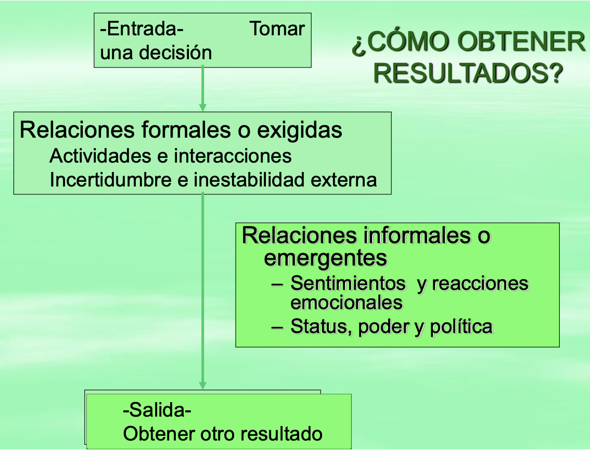
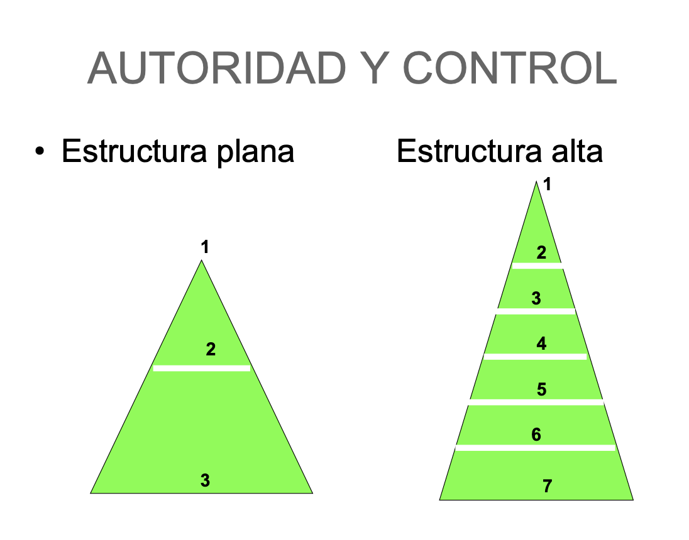

Resumen Estrorga
--

*Magalí Marijuán*
- [Estructuras de las organizaciones](#estructuras-de-las-organizaciones)
- [Áreas de actividad con funciones y subfunciones](#áreas-de-actividad-con-funciones-y-subfunciones)
  - [Secretaría y legales](#secretaría-y-legales)
  - [Administración de personal](#administración-de-personal)
  - [Finanzas y Control](#finanzas-y-control)
  - [Abastecimiento y compras:](#abastecimiento-y-compras)
  - [Investigación y desarrollo](#investigación-y-desarrollo)
    - [Las ingenierías de las empresas o planificación de la manufactura](#las-ingenierías-de-las-empresas-o-planificación-de-la-manufactura)
      - [Ingeniería del producto](#ingeniería-del-producto)
      - [Ingeniería de proceso](#ingeniería-de-proceso)
      - [Ingeniería de métodos](#ingeniería-de-métodos)
        - [¿Cómo es el estudio de métodos?](#cómo-es-el-estudio-de-métodos)
      - [Ingeniería de estándares](#ingeniería-de-estándares)
        - [¿Qué es el estudio del trabajo?](#qué-es-el-estudio-del-trabajo)
        - [Tiempo estandar](#tiempo-estandar)
        - [Indices de trabajo](#indices-de-trabajo)
  - [Comercialización](#comercialización)
  - [Actividades de planificación](#actividades-de-planificación)
  - [Plan agregado](#plan-agregado)
  - [Plan maestro](#plan-maestro)
  - [¿Por qué dividir en fábricas y talleres?](#por-qué-dividir-en-fábricas-y-talleres)
    - [Fábricas](#fábricas)
    - [Talleres](#talleres)
    - [Producción por montaje](#producción-por-montaje)
      - [MRP](#mrp)
      - [Manufactura esbelta - lean manufacturing](#manufactura-esbelta---lean-manufacturing)
    - [Producción intermitente](#producción-intermitente)
  - [Actividades primarias:](#actividades-primarias)
  - [Servicios](#servicios)
  - [Mantenimiento](#mantenimiento)
    - [Análisis de los mantenimientos](#análisis-de-los-mantenimientos)
    - [Costos de mantenimiento](#costos-de-mantenimiento)
- [Diseño de organizaciones](#diseño-de-organizaciones)
  - [Mecanismos coordinadores](#mecanismos-coordinadores)
  - [Visión jerárquica estructural piramidal](#visión-jerárquica-estructural-piramidal)
  - [El logo de Mintzberg](#el-logo-de-mintzberg)
    - [Nucleo operativo](#nucleo-operativo)
    - [La cumbre estratétgica](#la-cumbre-estratétgica)
    - [La línea media](#la-línea-media)
    - [El staff de apoyo](#el-staff-de-apoyo)
  - [Parametros de diseño](#parametros-de-diseño)
      - [Agrupamiento de unidades](#agrupamiento-de-unidades)
      - [Criterios básicos para agrupamiento de posiciones y unidades](#criterios-básicos-para-agrupamiento-de-posiciones-y-unidades)
      - [Dimensión de la unidad](#dimensión-de-la-unidad)
    - [3- Diseño de encadenamientos laterales](#3--diseño-de-encadenamientos-laterales)
    - [5- Ajustando el diseño a la situación](#5--ajustando-el-diseño-a-la-situación)
  - [Descentralización](#descentralización)
  - [Configuraciónes estructurales](#configuraciónes-estructurales)
    - [Estructura simple](#estructura-simple)
    - [La burocracia mecánica](#la-burocracia-mecánica)
    - [Burocracia profesional](#burocracia-profesional)
    - [La forma divisional](#la-forma-divisional)
    - [La adhocracia](#la-adhocracia)
      - [La adhocracia operativa](#la-adhocracia-operativa)
      - [La adhocracia administrativa](#la-adhocracia-administrativa)
  - [Requisitos de diseño](#requisitos-de-diseño)
  - [El diseño como configuración](#el-diseño-como-configuración)
- [Las escuelas del pensamiento administrativo](#las-escuelas-del-pensamiento-administrativo)
  - [Escuela de la ciencia del comportamiento](#escuela-de-la-ciencia-del-comportamiento)
  - [Escuela de enfoque de sistemas](#escuela-de-enfoque-de-sistemas)
  - [La teoría del equlibrio organizacional](#la-teoría-del-equlibrio-organizacional)
    - [Teoría X](#teoría-x)
    - [Teoría Y](#teoría-y)
  - [Teoría Z (escuela japonesa)](#teoría-z-escuela-japonesa)
  - [Teoría de la organización requerida](#teoría-de-la-organización-requerida)
- [Estructura formal e informal](#estructura-formal-e-informal)
    - [¿Cómo obtener resultados?](#cómo-obtener-resultados)
  - [Estructura informal](#estructura-informal)
    - [Naturaleza de la organización informal](#naturaleza-de-la-organización-informal)
    - [Características](#características)
    - [Orígenes de la organización informal](#orígenes-de-la-organización-informal)
    - [Elementos de la organización informal](#elementos-de-la-organización-informal)
    - [Aportes de la organización informal](#aportes-de-la-organización-informal)
    - [Pérdidas debidas a la organización informal](#pérdidas-debidas-a-la-organización-informal)
    - [Diagramas de la organización informal](#diagramas-de-la-organización-informal)
    - [Relaciones informales dominantes](#relaciones-informales-dominantes)
      - [Status](#status)
      - [Poder](#poder)
      - [Políticas](#políticas)
- [Diseño organizacional](#diseño-organizacional)
  - [Componentes del diseño organizativo](#componentes-del-diseño-organizativo)
    - [Ambiente externo](#ambiente-externo)
  - [La diferenciación, la integración y el ambiente](#la-diferenciación-la-integración-y-el-ambiente)
  - [Estructuras mecanizadas y organizadas](#estructuras-mecanizadas-y-organizadas)
    - [Estructura mecanizadas](#estructura-mecanizadas)
  - [El tipo de tecnología](#el-tipo-de-tecnología)
  - [Estructuras](#estructuras)
    - [Problemas de las organizaciones altas](#problemas-de-las-organizaciones-altas)
    - [Número ideal de niveles jerárquicos](#número-ideal-de-niveles-jerárquicos)
  - [Desafios de diseño organizacional](#desafios-de-diseño-organizacional)
  - [Estandarización y ajuste mutuo](#estandarización-y-ajuste-mutuo)
  - [Los elementos de la estructuración práctica](#los-elementos-de-la-estructuración-práctica)

# Estructuras de las organizaciones

**Objetivo de la materia:**

- Conocer la estructura de las organizaciones, sus niveles jerárquicos y las funciones que cumplen. 
- Adquirir destreza en relevar la estructura de cualquier organización. 
- Analizar los procesos funcionales de cualquier tipo de organización. 

**Tipos de empresa**: 
- Empresas familizares
- Sociedades civiles
- Manufactureras
- De servicios
- Pequeña y Mediana Empresa en Argentina

**Organización**:
Es una herramienta que utilizan las *personas* para *coordinar sus accione*s a fin de *obtener algo* que desean o valoran. 

**Organizaciones que satisfacen las necesidades de las personas:**

- Son creadas por un *emprendedor*. 
- El emprendedor *conoce las oportunidades para satisfacer necesidades*. 
- El emprenendeor *reúne y utiliza recursos* para cumplir su objetivo. 

**Teoría organizacional:**

Es el estudio de cómo funcionan las organizaciones y cómo afectan y a su vez ven afectadas por *el ambinente en que operan*. 

**Estructura organizacional:**

Es el *sistema formal de tareas y relaciones de autoridad* que controla *cómo* las *personas coordinan sus acciones y utilizan los recursos* para lograr las metas de la organización. 

**Cultura organizacional:**

*Conjunto de normas y valores compartidos* que controla las *interacciones* entre los integrantes de la organización y con los proveedores, clientes y otras personas externas a la misma. 

**Cambio organizacional:**

Proceso por medio del cual las organizaciones *rediseñan sus culturas y estructuras* *para pasar* de su estado actual a une *estado futuro deseado* para aumentar su efectividad. 

**Organigrama:**

Representación gráfica dde una estructura organizativa. 

# Áreas de actividad con funciones y subfunciones

## Relaciones externas:

Se encacarga de:

- La **coordinación de actividades públicas**
  - Participar en actividades cívicas
  - Las relaciones con otras sociedades
- La **comunicación e información**
  - Intercambio de información con empleados
  - Comunicaciones públicas
  - Apreciación de actitud y opinión 
  - Comunicaciones a acreedores e inversores

## Secretaría y legales

Se encarga de:

- Atención y resolución de problemas a: accionistas, directorio y sociedad. 
- Los temas legales son: 
  - Sociedad (organización)
  - Empleados
  - Asesoramiento en finanzas
  - Patentes

## Administración de personal

Se encarga de:

- Reclutamiento: 
  - Búsqueda 
  - Selección 
  - Instrucción 
  - Ascensos y transferencias 
  - Despidos
- Capacitación: 
  - Desarrollo de personal
  - Plan de carrera
  - Instrucción
  - Evaluación de capacitación
- Administración de sueldos y jornales:
  - Clasificación de los empleados
  - Determinación de escalas
  - Clasificación de méritos
  - Compensación suplementaria
  - Control de horarios
- Servicios para empleados
  - Servicios médicos
  - Recreación 
  - Servicios personales
  - Seguridad
- Relaciones industriales:
  - Comunicaciones
  - Negociación de méritos
  - Disciplina de personal 
  - Acreditación del personal

## Finanzas y Control

En cuanto a las **finanzas** se encarga de:
- Planificación financiera
- Relaciones financieras
- Administraciones de impuestos
- Custodia de fondos
- Créditos y cobranzas
- Seguros

En cuanto al **control** se encarga de:
- Contabilidad general 
- Contabilidad de costos
- Planificación
- Presupuesto
- Auditoría interna
- Sistemas y procedimientos

### Costos: 

**Costo de un producto**: la sumatoria de los gastos que demanda la fabricación de una unidad de dicho producto. 

**Los costos son necesarios para:**
- Controlar operaciones corrientes: compra, venta, control general
- Planeamiento a mediano y largo plazo: 
  
  $RENTABILIDAD = \frac{ganancia}{capital\_invertido}$

- Valuación de inventarios
- Cotización de precios
  
**Anatomía del costo de un producto**:

Clasificación de costos:
- **Costos Directos**
    - Materia prima
    - Mano de obra directa
- **Costos Indirectos**
    - de operación
    - de administración
    - de comercialización 

**Costos operativos** = costos de materia prima + costo de mano de obra directa + costos de operación
**Costos de producción** = costos operativos + costo de administración
**Costos totales** = cotos de producción + costos de comercialización

Precio de venta = **Costos totales** + beneficio que se quiere obtener

**Presupuesto**: puede definirse como la *manifestación formal de los planes y objetivos* de la dirección de la empresa, que *abarca todas las fases operativas* para un periodo determinado (normalmente un año), *expresado en términos monetarios*. 

**Control presupuestario**: es el análisis de los devíos entre: lo esperado, prespuestado o proyectado y la realidad. Es realizado por sectores reponsables, proporcionando realimantación al sistema para la toma de medidas correctivas y para rearmar el presupuesto. 

> Es útil pero dificil de aplicar. 

**Desventajas del control presupuestario**:
- es trabajoso
- es una programación 
- necesita método
- las personas no quieren ser controladas

## Abastecimiento y compras:

Se encarga de: 
- Adiquisiciones: individuales, cotizaciones, evaluación  selección de proveedores. 
- Seguimiento y activación de las compras: seguimiento de las compras y tiempo y lugar de recepción. 
- Registro y archivo de compras: archivo de catálogos y cotizaciones. Historial de proveedores.
- Venta de materiales recuperados: compradores de subproductos. 

- Si además de compras agregamos la gestión del depósito de materiales, tenemos: **suministros**

**El problema del suministro:** abastecer el material necesario en *cantidad, lugar y calidad* necesarios en el momento oportuno a un precio justo. 

**Tipos de stock:**
- Stock normal
- Stock en tránsito
- Stock de seguridad
- Stock de oportunidad
- Stoc de sobrantes y recuperación 

**¿Para qué mantener inventarios?**
- Mantener la independencia de las operaciones. 
- Satisfacer las variaciones de las demandas de productos
- Permitir la flexibilidad en los programas de producción
- Margen de seguridad en la variación de entrega de materias primas
- Aprovechar el tamaño económico del pedido

## Investigación y desarrollo

### Las ingenierías de las empresas o planificación de la manufactura
#### Ingeniería del producto

**Función principal**: definir el producto en forma explícita contemplando las exigencias del mercado y técnicas económicas. 

Determinar el "qué" se va a producir

**Otras funciones:**
- Control y comunicación de documentos de producto
- Ingeniería de aplicación 
- Ensayo de producto y determinación de confiabilidad
- Análisis de producto en campo de aplicación 
- Investigación y desarrollo
- Establecer y mantener los standars del producto. 
- **Función de investigación**: investigación básica e investigación aplicada
- **Función de desarrollo**:
  - Desarrollo avanzado 
  - Desarrollo y mejoramiento de productos nuevos
  - Desarrollo y mejoramiento de procesos nuevos
  - Rediseño de productos para reducir costos
- **Función de ingeniería de productos**:
  - Diseño de productos
  - Ensayos de ingeniería
  - Seguimiento de la producción 
  - Asesoramiento a ventas

#### Ingeniería de proceso

**Función principal:** se ocupa de las formas en que se realizan las tareas y la tecnología de los procesos y su optimización. 

Para ello debe:
- Contemplar desarrollo histórico
- Foco en cómo diseñar procesos
- Documentos necesarios de aplicación 

#### ¿Cómo diseñar procesos?

Se deben conocer lo siguientes elementos: 
- Disponibilidad de maquinaria y puestos de trabajo
- Lay out de la fábrica, distribuición en la empresa. 
- Mano de obra disponible y su calificación. 
- Estandarés de métodos de operaciones y materiales
- Estado y precisión de las máquinas
- Normalizaciones y estandarizaciones. 
  
#### Ingeniería de métodos
 
**Función principal:** definir el método, la forma de realizar la tarea, en cuanto a: disposición de máquinas, disposición de personas y disposición del herramental. 

**Otras funciones:**
- Establecer un **método de trabajo**
- Capacitar al personal del mismo
- Controlar su estricta aplicación
- Análisis de mejoras al método propuesto
- Aplicar la técnica del **estudio del trabajo**

##### ¿Cómo es el estudio de métodos?

1) Seleccionar el trabajo que se va a estudiar. 
2) Registrar todo lo que sea pertinente del método actual por observación directa. 
3) Examinar con espíritu crítico lo registrado, en sucesión ordenada utilizando las técnicas más apropiadas en cada caso. 
4) Idear el método más práctico, económico y eficaz, teniendo debidamente en cuenta todas las contingencias previsibles. 
5) Definir el nuevo método para poder reconocerlo en todo momento. 
6) Implantar ese método como práctica normal 
7) Mantener en uso dicha práctica instituyendo inspecciones regulares. 

#### Ingeniería de estándares

Funciones:
- Aplicar técnicas de estudio del trabajo
- Lograr estandarizar condición de trabajo
- Medir el trabajo
- Calcular estándares de operación 
  
##### ¿Qué es el estudio del trabajo?

Se entiende por estudio del trabajo, genéricamente, ciertas técnicas, en particular el estudio de métodos y medición del trabajo que se utilizan para analizar el trabajo humano en todos sus conceptos, y que llevan sistemáticamente a investigar todos los factores que influyen en la eficiencia y economía de la situación estudiada, con el fin de efectuar mejoras. 

##### Tiempo estandar

Definición de medición del trabajo: es la aplicación de técnicas para determinar el tiempo que invierte un trabajador calificado en llevar a cabo una tarea definida efectuándola según la norma de ejecución preestablecida. 

##### Indices de trabajo

Se tiene en cuenta: 
- Contenido del trabajo. 
- Principios de economía de movimeintos: 
  - Utilización del lugar de trabajo
  - Arreglo del lugar de trabajo
  - Diseño de máquinas y equipos

Algunos índices pueden ser:

- $PRODUCTIVIDAD = \frac{producto\_obtenido}{factor\_consumido}$

- $APROVECHAMIENTO = \frac{tiempo\_efectivo\_empleado}{tiempo\_disponible}$

- $RENDIMIENTO = \frac{tiempo\_estandar}{tiempo\_efectivamente\_empleado}$

## Comercialización

- Investigación de mercado: 
  - Análisis de mercado
  - Determinación de las características del mercado
  - Análisis de problemas de distribución 
- Publicidad
  - Planeamiento de la campaña
  - Preparación de los textos
  - Selección de los medios
  - Producción
- Promoción de ventas 
  - Desarrollo del problema
  - Elementos auxiliares para las ventas
- Planeamiento de ventas
  - Determinación de políticas de venta
  - presupuesto
  - Políticas de precios
  - Compras
  - Embalaje
- Operaciones de ventas:
  - Obtención de vendedores
  - Entrenamiento de vendedores
  - Dirección de vendedores
  - Remuneración de vendedores
  - Servicio de pedidos 
  - Ventas
- Distribución física
  - Almacenes
  - Expediciones
  - Servicio del producto
  - Servicio del producto
  - Logistica
- Interupcción de internet:
  - Cada vez más clientes con tecnología para operar en red
  - Necesidad de disminuir costos
  - Desaparición de límites
  - Imperiosa necesidad de aumentar la velocidad de las transacciones

## Visualización de planificación de las operaciones

**Planeamiento estratégico**: 
Consiste en: objetivos, estratégias, políticas globales, plan de empresa a largo plazo.

Conlleva al **Planeamiento táctico**:

Consiste en: bjetivos y planes a corto y mediano plazo para áreas funcionales 

Conlleva al  **planeamiento operativo**: 

Consiste en: actividades de ejecución y control 

## Actividades de planificación

## Plan agregado

Dado un **plan de negocio** obtenemos un **plan agregado** del que surgirá un **plan maestro de producción.**

El **plan agregado** consiste en la declaración de la tasa de trabajo, niveles de fuerza de trabajo y manejo de inventarios, basado en los requisistos del cliente y las limitaciónes de capacidad.

## Plan maestro

Surge del **plan agregado**. Considera las siguientes variables: 

*Vemos que abarca todas las aréas mencionadas antes*
- Operaciones:
  - Capacidad actual de maquinaria
  - Planes de capacidad futura
  - Capacidad de la fuerza de trabajo
  - Nivel actual de personal
- Plan agregado: 
  - Necesidades del cliente 
  - Pronóstico de la demanda
  - Comportamiento de la competencia
- Contabilidad y finanzas
  - Datos sobre costos
  - Situación financiera sobre costos
- Recursos humanos
  - Condiciones en mercado de mano de obra
  - Capacidad en capacitación
- Ingeniería 
  - Nuevos productos
  - Cambios en el diseño de productos
  - Normas para máquinas
- Materiales
  - Capacidad de proveedores
  - Capacidad de almacenamiento
  - Disponiblidad de materiales. 

## ¿Por qué dividir en fábricas y talleres? 

|   Características  |      Fábricas     |      Talleres      |
|:------------------:|:-----------------:|:------------------:|
|    Trabajan en     | para stock        | a pedido           |
| Realizan el costeo | por producto      | por lote           |
|    La ingeniería   | está en la planta | ingresa con pedido |

### Fábricas

Pueden ser:

- **Por montaje**, encadena una secuencia de procesos que convergen en un producto final.

- **Continua**, orientadas hacia el producto. Pueden ser:

  - **Ultra continuas**, grandes volúmenes. 

  - **Continua por lotes**, cantidades grandes de diferente variedad o producto. 

### Talleres

Pueden ser:

- **Intermitente**: tipo de taller, muchos pedidos de clientes y muy bariados. Un cliente -> una órden de producción. 
- **Por proyectos**: 1 o pocas unidades, obras de magnitud, mucho tiempo de producción.

### Producción continua

Características: 
- Grandes volúmenes
- Diseño de planta según producto
- Son de capital intensivo (alta automatización) Capital fijo y circulantes
- Existen subproducto importantes
- Es importante la logística y el mantenimiento. 

Subtipos: 
- **Ultra continua:** por ejemplo: celulosa, papel, aceite, nafta, leche. 
- **Producción continua por lotes** por ejemplo: cosméticos, galletitas, imprentas, seguros. 

### Producción por montaje

Características:
- Varias tareas de tipo intermitente que confluyen en un alinea de montaje. 
- Producciones de muchas materias primas y subconjuntos que se unen en un único producto. 

#### Sistemas de programción por montaje: 
- **Manual, mental.** 
- **MRP**
- **JAT - manufactura esbelta**
- **TOC - manufactura sincronizada**

#### MRP 

La planificación de los materiales o MRP es un sistema de planificación y administración, normalmente asociado con un software que planifica la producción y un sistema de control de inventarios.

Dados los siguientes parámetros: 

- Artículos: código, denominación, costo, fabricado o comprado, unidad de medida, lead time, ubicación. 
- Estaciones: código, estación, tarifa horaria. 
- Actividades productivas: código actividad, tiempo de preparación y estándar, estación de trabajo, mano de obra. 
- Estructura de producto: código de articulo anterior y posterior, cantidades, merma. 
- Plan maestro: código, periodo, cantidad planeada. 

Se obtiene:

INFORMACIÓN DE SALIDA: programa de producción, órdenes de fabricación, compras y órdenes de compra, imposiblidad de cumplimiento, inventarios materiales a recibir y comprometidos, control y costeo de la producción y carga de máquinas. 

#### Manufactura esbelta - lean manufacturing

Necesita: 
- Una filosofía kaizen bien conocida
- Trabajadores polivalentes y comprometidos
- Un sistema de calidad bien implantado

Se apoya en MRP y evita pérdidas como: 
- Sobre producción
- Esperas
- Gandes inventarios
- Movimientos improductivos
- Fabricación de productos defectuosos. 
- Incumplimiento de tiempos de entrega

### Producción intermitente

Esta industria se moviliza en función del pedido del cliente. La ingeniería ingresa en ese momento y el costeo es por pedido. 

Características: 
- Gran diversidad de productos con bajo volumen de producción.
- Muchas órdenes de producción de pedidos de clientes. Cada órden se programa con un caso particular. 
- Agrupamiento de máquinas por proceso. 
- Mano de obra altamente calificada. 

## Actividades primarias: 
  
Ejemplos: agrícuola, frutícola, ganadera, minera, pesquera, granja. 

Característica principal: **INCERTIDUMBRE**. 
- En los productos por ser commodities. 
- En los recursos por su relación con la naturaleza. 

Los recuros: 
- La tierra (la naturaleza)
- La mano de obra (permanente y temporaria)
- El clima
- El capital invertido
- La dirección (el administrador)
- Factores institucionales (cámaras, etc)
- La conservación (preservar fertilidad, control de enfermedades, control de erosión)

Asimilación de formas de planificación: 
- Continua: tambo, extracción de minerales. 
- Montaje: armador de pesca
- Intermitente: cultivo de granja
- Por proyecto: siembra, pesca de altura, cria de ganado, plantación. 

## Servicios

Características:
- Imposibilidad de stockear
- La calidad del trabajo / la calidad del servicio
- Hay atributos tangibles e intangibles
- Muchos tienen continuidad

Clasificación de los servicios:

|                                        | Personalizado o baja eestandarización | Diseños múltiples, bajo volumen         | Diseños variados, alto volumen     | Estandarizados, muy alto volumen |
|----------------------------------------|---------------------------------------|-----------------------------------------|------------------------------------|----------------------------------|
| Flujo discreto, producción por órdenes | Servicios profesionales en general    |                                         |                                    |                                  |
| Taller                                 | Restaurant 5 tenedores                |                                         |                                    |                                  |
| Flujo discreto, producción continua    |                                       | Dispensario barrial - servicio de salud |                                    |                                  |
| Linea de ensamble                      |                                       |                                         | Transporte público comidas rápidas |                                  |
| Flujo continuo                         |                                       |                                         |                                    | Servicio eléctrico, gas          |

Los servicios se programan tomando el modelo de producción que más se asemeja al caso. Se optimizan buscando un ajuste de oferta y demanda. 

**Ajuste de demanda:** Incentivos de precios, uso de publicidad, acumulación mediante reservas o colas. 

**Ajuste de oferta:** régimen de turnos del personal, horas extra, trabajo temporal, programación de mantenimiento, acumulación de complementos. 

## Mantenimiento

### Análisis de los mantenimientos

|              Concepto              |               Ventajas               |      Desventajas      |           Aplicación          |
|:----------------------------------:|:------------------------------------:|:---------------------:|:-----------------------------:|
| **Correctivo**: por falla o rotura     | Costo ante falla                     | Incertidumbre         | En todos los casos            |
| **Preventivo**: historial de fallas    | El mantenimiento es programados      | Puede ser innecesario | Generalizado en averías caras |
| **Predictivo**: monitoreo de variables | Se conoce el estado de máquina       | Caro de implementar   | Casos especiales              |
| **TPM**: productivo total              | Realizado por operarios involucrados | Sólo tareas básicas   | Empresas SGQ avanzado o TQM   |

### Costos de mantenimiento

**Costos visibles**, como por ejemplo: materiales, mano de obra, servicios de terceros, lucro cesante por paradas. 

**Costos ocultos**, accidentes por falla de equipo de seguridad, deterioro del ritmo de producción, baja de la calidad de producto, acortamiento de la vida útil de un equipo, inmovilización de inventarios. 

# Diseño de organizaciones
(*Mitzberg*)

## Definición

La estructura de una organización puede ser definida como la suma total de las formas en que su **trabajo es dividido** entre diferente áreas y luego **es lograda su coordinación** entre esas tareas. 

## Mecanismos coordinadores

- **Ajuste mutuo**: por el proceso de comunicación informal. El control en manos del grupo. 
- **Supervisación directa**: una persona toma la responsabilidad por el trabajo de otras emitiendo instrucciones para ellas y supervisando sus acciones. 
- **Estandarización de procesos**: Procesos estandarizados con contenidos especificados o programados. 
- **Estandarización de producciones de trabajo**: las producciones son estandarizadas cuand o los resultados del trabajo están especificados. 
- **Estandarización de destreza de los trabajadores**: Las destrezas (conocimientos) son estandarizados cuando está especificado el tipo de capacitación que se requiere para efectuar el trabajo. 

## Visión jerárquica estructural piramidal

El **nivel político** se encarga del diseño del sistema, establecer objetivos y supervisar. 

Característica de las decisiones: 

Asegura que la actividad de la organización se desarrolle dentro de los limites de aceptación del ambiente y se mantengan las condiciones de supervivensia y crecimiento

El **nivel administrativo** se encarga del proceso de toma de decisiones programadas. 

Caracterítica de las decisiones:

Adopta decisiones sobre distribución y asignación de recursos, control de operaciones. Se comunica con los otros dos niveles.

El **nivel técnico** se encarga de los procesos de trabajo. 

Característica de las decisiones:

Responsable de la ejecución de las actividades de producción de bienes y la prestación de servicios a clientes. 

## El logo de Mintzberg

### Nucleo operativo

- Aseguran insumos a la producción
- Transforman los insumos en productos
- Distribuyen las porycciones
- Proveen apoyo directo a la producción

### La cumbre estratétgica

El gerente y sus asesores directos, tienen 3 obligaciones:
- Supervisión directa
- Administración de las relaciones con el ambiente
- Desarrollo de la estrategia de la organización 

### La línea media

Es el grupo e un en linea de comando a la cumbre con el núcleo operativo. Desde altos gerentes hasta el supervisor de fábrica. 

### La tecnoestructura

Los analistas que diseñan, planean o entrenan gente para la corriente de trabajo operacional. 

- Analistas de estudio de trabajo. 
- Analistas de planeamiento y control.
- Analistas de personal.

### El staff de apoyo

Son unidades de trabajo de apoyo a la organización. 

Departamento de pagos, librería, cafetería, seguridad, portería, grupo de investigación. 

En una universidad: librería, imprenta, tesoreria, seguridad, deportes. 

## Parametros de diseño

| Grupo                                                                        | Parámetros de diseño                                                                               |
|------------------------------------------------------------------------------|----------------------------------------------------------------------------------------------------|
| 1 - Diseño de posiciones                                                         | - Especialización de la tarea - Formalización del comportamiento - Capacitación y adoctrinamiento  |
| 2- Diseño de la superestructura                                                 | - Agrupamiento por unidad - Dimensión de la unidad                                                 |
| 3- Diseño de encadamientos laterales. Rellenando la super estructura.           | - Sistema de planeamiento y control - Dispositivos de enlace                                       |
| 4- Diseño de sistemas de toma de decisiones. Desenrredando la descentralización | - Descentralización vertical - Descentralización horizontal                                        |
| 5 - Ajustando el diseño a la situación                                           | - Edad y dimensión - Sistema técnico - Ambiente                                                    |

### 1- Diseño de posiciones individuales

**Especialización horizontal**: forma predominante de la división del trabajo. 

**Especialización vertical**: separa el desempeño del trabajo de la administración del mismo. 

**Formalización del comportamiento**: para que el efecto de la tarea se igual con cualquier individuo (burocratización).

**Capacitación**: conocimiento y destreza. 

**Adoctrinamiento**: Socialización (un nuevo miembro aprende el sistema de valores y los sistemas de comportamiento requeridos por la organización a la que está entrando).

Tener en cuenta que decir baja especialización horizontal significa hacer muchas tareas diferentes. 

Tener baja especialización vertical significa hacer tareas de muchos niveles diferentes. 

### 2- Diseño de super estructura

#### Agrupamiento de unidades

El agrupamiento es un medio fundamental para coordinar el trabajo de la organización (4 efectos importantes): 

- Sistema de supervisión común entre posiciones y unidades.
- La coordinación de ajustte mutuo (estimula MC)
- Posiciones y unidades comparten recursos comunes
- Medidas comunes de desempeño (estandarización)

#### Bases para el agrupamiento

- Por conocimiento y destreza. 
- Por proceso de trabajo y función 
- Por producción 
- Por tiempo cronológico
- Por cliente
- Por lugar

#### Criterios básicos para agrupamiento de posiciones y unidades

- Interdependencia de la corriente de trabajo (lineas de tareas)
- Interdependencia de proceso (Agrupamiento funcional)
- Interedpendencia de escala (mantenimiento)
- Interdependecias sociales. 

#### Dimensión de la unidad

¿Cuántas personas deben informar a un gerente?

La dimensión de la unidad varía según:

(aumenta)
- Estandarización de 3 tipos
- Similitud de tareas realizadas
- Necesidad de empleados de autonomía y autorrealización
- Menos distorsión de información ascendente. 

(disminuye)
- Estrecha supervisión directa
- Necesidad de ajuste mutuo entre tareas complejas
- Si el gerente tiene tareas de no supervisión que realizar
- Necesidad de los miembros de acceso al gerente
- Cuanta más información en ajuste mutuo menor la unidad de trabajo. 

### 3- Diseño de encadenamientos laterales

Sistemas de planeamiento y control. El propósito de un plan es especificar una producción deseada en algún momento futuro. Y el propósito del control es apreciar si este plan se ha cumplido o no. 

No puede haber control sin planeamiento previo, estos regulan las producciones e indirectamente el comportamiento.

Entonces:

- Control de desempeño (de cada unidad)
- Dispositivos de enlace (gte integrador, fuerzas de tareas, comisiones permanentes).

### 4- Diseño de sistemas de toma de decisiones

**Descentralización vertical**
- Qué poderes de decisión deben ser delegados
- Hasta dónde deben descender esos poderes
- Cómo debe ser coordinado o controlado su uso. 

**Descentralización horizontal**
- El poder recae en un individuo de línea
- El poder a los analístas de la tecno estructura
- El poder a los expertos
  
### 5- Ajustando el diseño a la situación

**Ambiente** todo lo que es externo a la empresa.

Características:

- Simple o complejo: pocos factores relacionados / conocimiento sofisticado de producto y/o clientes.
- Estable o dinámico: los cambios son predecibles / no se pueden predecir cambios. 
- Munificente u hostil: apoya y mantiene la organización / competencia, sindicatos, gobiernos.
- Integrado o diversificado: producto único 1 sola zona geográfica / clientes en zondas distintas.

**Teconolgia**: la que usa la organización 

**Poder**: capacidad de imponer a otros la propia voluntad / interno y externo (sindicatos, accionistas, proveedores, etc).

**Edad y tamaño**

## Descentralización 

Tipos:

a) **Centralización vertical y horizonal**: el poder de decisión centrado en el gerente en la cima jerárquica.
b) **Desentralización horizontal limitada (selectiva)**: el poder formal concentrado en la parte superior de la línea jerárquica. 
c) **Descentralización vertical limitada**: la organización está dividida en unidades de mercado o divisiones con gerentes que toman decisiones para sus mercados. 
d) **Desentralización vertical y horizontal selectiva**: en dimensión vertical el poder delegado en varios niveles de jeraría y en la dimensión horizontal uso selectivo de expertos de staff. 
f) **Descentralización vertical y horizontal**: el poder de decisión centrado en el núcleo operativo. 

## Configuraciónes estructurales

### Estructura simple

**Mecanismo coordinador principal**: supervisión directa. 
**Parte clave**: cumbre estratégica. 
**Principales parámetros de diseño**: centralización, estructura orgánica. 
**Factores situacionales**: joven, pequeña, sistema técnico no sotisficado, ambiente simple, dinamico, posible hostilidad extrema o fuertes necesidades de poder del gerente general, fuera de moda. 

### La burocracia mecánica

**Mecanismo coordinador principal** estandarización de procesos de trabajo. 
**Parte clave d ela organización**: la tecno estructura. 
**Principales parámetros de diseño**: 
- Formalización del comportamient
- Especialización de la tarea vertical y horizontal. 
- Unidad operativa grande
- Descentralización horizontal limitada
**Factores situacionales**: atigua y grande

### Burocracia profesional

**Mecanismo coordinador**: estandarización de destrezas. 
**Parte clave de la organización**: núcleo operativo. 
**Principales parámetros de diseño**: 
- capacitación
- especialización horizontal de tarea
- descentralización vertical y horizontal
**Factores situacionales**:
- ambiente complejo y estable
- sistema téncnico no regulador, no sotisficado
- de moda
**Burocracia profesional**: común en universidades, hospitales, sistemas escolares, etc. Todos confían en las destrezas y el  conocimiento de sus profesionales. 

### La forma divisional

**Mecanismo coordinador principal**: estandarización de productos.

**Parte clave de la organización**: línea media. 

**Principales parámetros de diseño**: 
- grupo comercial, 
- sistema de control de desempeño 
- desentralización vertical limitada.

**Factores situacionales**: 
- mercado diversificados (especialmente productos y servicios)
- antigua, grande 
- necesidades de poder de los gerentes intermedios
- de moda. 

### La adhocracia

**Mecanismo coordinador principal**: ajuste mutuo
**Parte clave de la organización**: staff de apoyo en la adhocracia administrativa; staff de apoyo y núcleo operativo en la adhocracia operativa. 
**Principales parámetros de diseño**:
- dispositivos de enlace
- estructura orgánica
- descentralización selectiva
- especialización de cargos
- capacitación
- agrupamiento funcional y de mercado a la vez

**Fatores situacionales**: 
- ambiente complejo
- dinamico (aveces dispar)
- joven (especialmente en la adhocracia operativa)
- sistema técnico sofisticado y a menudo automatizado (en la adhocracia administrativa).
- de moda
  

#### La adhocracia operativa

Innova y resuelve problemas directamente en nombre de sus clientes. 

Frente a un problema de un cliente realiza un esfuerzo creativo para encontrar una solución orginal. 

Descentraliza el poder a sus especialistas altamente capacitados. 

Los especialistas interactuan informalmente por ajuste mutuo en grupos de proyecto. 

Rasgo clave: sus trabajos administrativos y opertivo tienden a fusionarse en un sólo esfuerzo. 

Difícil diferencial el planeamiento y diseño del trabajo en ejecución. 

#### La adhocracia administrativa

Hace una clara distinción entre su componente administrativo y su núcleo operativo. 

Núcleo operativo truncado separado del resto de la organización. 

Puedo dejar de lado el núcleo operativo contratando el de otras organizaciones. 

Ej.: Proyecto apolo de la NASA se concentra en el trabajo de desarrollo y para producción contrata firmas manufactureras independientes. 

## Requisitos de diseño

**Efectividad** o eficacia: es hacer las cosas que se deben hacer -enfoque al logro de objetivos. 

**Eficiencia**: es hacer las cosas bien- enfoque en el uso de recursos. 

**Calidad**: grado en el que un conjunto de características inherentes cumple con las necesidades o expectativas establecidad. 

**Creación de valor**: todas las operaciones que al realizarse aumentan el valor del producto o servicio desde la perspectiva del cliente. 

## El diseño como configuración

| Configuración estructural 	| Mecanismo coordinador principal        	| Parte clave de la organizacion 	| Tipo de descentralización               	| Tendencia a     	|
|---------------------------	|----------------------------------------	|--------------------------------	|-----------------------------------------	|-----------------	|
| Estructura simple         	| Supervisión directa                    	| Cumbre estrategica             	| Centralizacion vertical y horizontal    	| centralizar     	|
| Burocracia mecanica       	| Estandarización de procesos de trabajo 	| Tecnoestructura                	| Descentralización horizontal limitada   	| estandarizar    	|
| Burocracia profesional    	| Estandarización de destrezas            	| Nucleo operativo               	| Descentralizacion horizontal y vertical 	| profecionalizar 	|
| Forma divisional          	| Estandarización de producciones        	| Línea media                    	| Desentraliacion vertical limitada       	| balcanizar      	|
| Adhocracia                	| Ajuste medio                           	| Staff de apoyo                 	| Descentralizacion selectiva             	| para colaborar  	|

# Las escuelas del pensamiento administrativo

- Clásica
- Estructuralista - la burocrática
- De las ciencias del comportamiento
- Cuantitativa
- De enfoque en sistema
- De enfoque en contingencias
- Mintzberg
- De la cultura organizacional
- La organización requerida

## Escuela clásica

Sus orígenes
- La organización militar: la unidad de mando
- La revolución francesa: teroía de economías libres. Separa la economía del estado.
- Adam Smith: crador de la escuela clásica con la divisióndel trabajo, en la especializacion y con las funciones de la empresa.
- David Ricardo: esatablece los principios de la economía liberal. 
- La revolución industrial: produce una explosión de empresas, muy desordenada y poco eficientes. 

### Escuela de administración científica

La preocupación básica era aumentar la productividad de la empresa mediante el aumento de la eficiencia en el nivel operacional. La administración científica desarrolla un enfoque de abajo hacia arriba (del obrero al supervisor y el gerente).

Características:
- Creación de una base científica capaz de sustituir los métodos de trabajo tradicionales. Investigaciones científicas de cada componente del mismo. 
- Selección de los obreros con base en criterios científicos, entrenamiento y aprendizaje de los obreros. 
- Colaboración entre la administración y los obreros en la aplicación práctica del sistema científico de la organización del trabajo. 
- Distribución equitativa del trabajo y de la responsabilidad, entre la administración y los obreros. 

Solo con estandarización forzosa de los métodos, condiciones de trabajo y cooperación frozosa se puede lograr la aceleración general del ritmo del trabajo. Este logro recae en la administración de la empresa. 

Federick Winslow Taylor: padre de la administración científica. Su preocupación fue: bajar costos, elevar utilidades y subir salarios. 

### Escuela de administración industrial y general

De Henry Fayol

Fayol se ocupa de las funciones propias de la dirección de la organización y las define como funciones esenciales de la administración y enuncia 5 elementos de administración.  

Los cinco elementos de la administración son: 
- Planificar
- Organizar
- Coordinar
- Dirigir
- Controlar

Énfasis en la estructura y la eficiencia de funcionamiento. Esta corriente tiene como precaución básica aumentar la eficiencia de la empresa, a través de la forma y disposición de los órganos competentes de la organización. 

Las funciones esenciales de Fayol: 
- La actividad técnica
- La actividad financiara
- La contabilidad
- La actividad comercial 
- La actividad de seguridad
- La administración de personal

14 Principios de Fayos de cómo administrar organizaciones: 
- División del trabajo. 
- Disciplina. 
- Unidad de dirección. 
- Subordinación de los intereses particulares al interés general. 
- Iniciativa. 
- Autoridad y responsabilidad. 
- Unidad de mando. 
- Remuneración. 
- Centralización. 
- Orden 
- Estabilidad de los cargos de personal. 
- Unidad de personal. 
- Jerarquía. 
- Equidad. 
  
## Escuela estructuralista

De Max Weber

Modelos de burocracia - principio:

1. Autoridad(racional y legal): se obedece por jerarquía y no por carísma. 
2. Las funciones: por competencia técnica y no por status social. 
3. Clara responsablidad y autoridad. 
4. Jerarquía de los cargos (claramente definida).
5. Reglas y procedimientos estándar.
6. Las acciones y reglas por escrito. 

La escuela estrucutralista fue la continuadora de estas reglas. 

## Escuela de la ciencia del comportamiento 

Desacreditar el papel que desempeñan los recursos humanos constituye un defecto rogánico en la escuela clásica. 
El gerente debe emplear las mejores prácticas en relaciones humanas. 

Características:
- Aplicación de ciencias del comportamiento en la administración. 
- Énfasis en participación y las formas de manejar los conflictos. 
- Atención a necesidades y motivaciones de los individuos en el trabajo. 
- Manejo del uso de la autoridad. 
- Atención en las relaciones informales dentro de un ambiente de trabajo. 
- Demuestra la variedad de estilos de liderazgo a disposición del administrador. 
- Hace foco en la existencia e importancia del sistema informal de conducta de relacioens. Concibe la administración como un sistema de decisiones. 
  

## Escuela cuantitativa

Taylor fue un pionero en el enfoque.  La tería de la matemática de la escuela cuantitativa se preocupa por construrir modelos matemáticos capaces de simular situaciones reales de la empresa. Énfasis en el poder decisorio. 

Características: 
- Concepto de investigación de operaciones durante la wwii
- Construye modelos matemáticos capaces de simular situaciones de la empresa. 
- Se orienta a la solución de problemas en la toma de decisiones. 
- Optimizar la realización del trabajo y disminuir los riesgos involucrados. 
- Hace énfasis en el proceso decisorio que es la secuencia de pasos que conformar una decisión. 
  
Tiene como enfoque: 
- Formular el problema. 
- Constriuir un modelo matemático para representar el sistema expresando la efectividad del sistema como función de un conjunto de variables. 
- Derivar una solución del modelos, encotnrando valores de las variables para maximización de la efectividad. 
- Probar el modelo de la solución resultante. Evaluar y comparar lo previsto con lo logrado. 
- Establecer controles sobre la slución. Posibles variaciones de las partes que constan la solución. 
- Ejecutar la colución. 
  
## Escuela de enfoque de sistemas
Ludwig Von Bertalanffy

Características: 
- Las funciones de un sistema depende de su estructura. 
- Las organizaciones existen dentro de sistemas. 
- Los sistemas son abiertos. 
- Cada sistema que se examine, recibe y descarga algo en los otros sistemas. 
- Sistema es un conjunto de objetos relacionados entre sí y con su ambiente de tal modo que forman una suma total o totalidad. 
  
La organización como sistema. 

Conjunto: es una colección bien definida de elementos. 
Objetos: Son las funciones o actividades que se desarrollan para alcanzar un objetivo. 
Ambiente: está vinculado al concepto de límite. Son variables fuera de control de la organización. 

## Escuela de enfoque de consistencias

Caracteristicas:

- Busca comprender y explicar el modo como funcionan las empresas en diferentes condiciones. Dichas contigencias pueden considerarse como oportunidades o como imperativos o restricciones que influyen sobre la estructura y los procesos internos de la organización. 
- El conocimiento del ambiente se volvió vital para la compresión de los mecanismos organizacionales. 
- Los gerentes deben tener en centa las distintas realidades y no deben intentar dar una misma solución a todos los problemas sino buscar la particular a cada uno de ellos. 
- No hay nada absoluto en las organizaciones ni en la teoría administrativa. 
- Siempre se depende de algún factor. 
- El enfoque contigencial dice que hay relación entre ocndiciones del ambiente y técnicas administrativas para alcanzar eficazmente los objetivos de la organización. 
- En esta relación funcional, las variables ambientales son independientes y las variables técnicas administrativas son dependientes. 

## La teoría de Mitzberg

(el logo más lo que vimos antes)

## La teoría del equlibrio organizacional

Características: 
- Parte de los supuestos enque puede sobrevivir la empresa. Debo atender toda circustancia que pueda variar las relaciones de equilibrio. 
- Esto es mientras los sujetos consideren que la organización les sirve para el cumplimiento de sus objetivos, estarán dispuestos a subordinar su actividad a la que surge del sistema totalizado. 
- El equilibrio de la organización se alcanza cuando se logra el óptimo global en el cumplimiento de los objetivos de la organización. Óptimo que exige la satisfacción de los objetivos de los participantes. 
- Alcanzar un equlibrio en el punto donde se permite una máximización del objetivo empresarial, conincidentemente con una minimización de pagos otorgados a los participantes de la realización de susu objetivos personales. 
- En una empresa puede manifestarse en una reducción de personal, aumento de salarios y de capital, incremento de mercado, etc. 

## Escuela de la cultura organizacional

o de la teoría japonesa y sus gurues. 

Teoría X y teoría Y. Son dos teorías contrapuestas. 

### Teoría X

- El individuo trabaja lo menos posible. 
- Carece de ambición. 
- Evita responsabilidades. 
- Prefiere que lo dirijan. 
- Se resiste al cambio. 
- Haría poco por la empresa si no fuera por la dirección. 

### Teoría Y

- El individuo considera el trabajo natural como un juego. 
- Se auto dirige. Busca cumplir objetivos. 
- En ciertas condiciones acepta responsabilidades. 
- Tiene imaginación y creatividad. 
- Siente motivación y busca perfeccionarse. 
- Asume objetivos si recibe compensación. Le reconocen méritos. 

## Teoría Z (escuela japonesa)

Énfasis en el bienestar del empleado dentro y fuera del trabajo. Valores que más destacan:
- Confianza en la gente. Autocontrol entre los trabajadores. 
- Relaciones sociales estrechas. No sólo funcional. 
- Sutileza delas relaciones humanas. Trato específico. 
  
Estrategias de las organizaciones Z: 
- Empleo a largo plazo: organización comprometida con los empleados. Garantía de estabilidad. 
- Filosofía organizacional única. Imagen clara de objetivos y valores. Énfasis en cooperación y trabajo en equipo. 
- Socialización Intensiva. Énfasis en la integración de nuevos empleados para que se ajusten a la organización. 

En teoría Z, si pretendemos incrementar la calidad y la productividad:
1. La clave es involucrar a los trabajadores en el proceso. 
2. Depositar confianza en las personas. 
3. Distinguir sutilezas (mensajes no verbales).
4. Incrementar la relación: humano-laboral.

## Teoría de la organización requerida

Características:
- Alcance temporal de la discreción. 
- La estratificación natural del trabajo. 
- Paga sentida como justa. 
- Nivel jerárquico. 
- La distribución estratificada de las tareas determina que la organización está compuesta por niveles ejecutivos jerárquicos.
- Jaques lo explica a través de la capacidad diferencial del trabajo, o sea el modo que la gente percibe, planifica, organiza y resuelve sus tareas. 
- La capacidad individual la llama el horizonte temporal personal o sea el límite al cual se dirigen las intenciones del individuo. Cuando más remoto es el futuro intencional al que se apunta mayor es la capacidad individual. 

# Estructura formal e informal 

## Estructura formal 

### Características
- Las estructuras son establecidas por la dirección. 
- Es la organización basada en la división del trabajo, e integrado de acuerdo a algún criterio. 
- Es comunicada a todos mediante organigramas manuales y descripción de cargos. 
- En el modelo clásico la asignación de personal y sus relaciones recíprocas son establecidas por los gerentes. 
- Los gerentes deben ser capaces de predecir el comportamiento de los otros pero al ser humanos se acrecienta la incertidumbre y la impronosticabilidad. 

### ¿Cómo obtener resultados? 

## Estructura informal

### Naturaleza de la organización informal

Nos proponemos examinar la organización informal, sus valores y costos. 

1. Sin lo formal, lo informal no existe
2. Los sistemas, las personas <-> espontaneidad e innovación y cambio. 
   
### Características

Es el conjunto de las interacciones y relaciones que se establecen entre los individuos de una organización. 

Están relacionadas con: 
- Valores
- Estilos de vida
- Logros de la vida social

### Orígenes de la organización informal
- Por amistad o por antagonismo
- Por relaciones de trabajo o sociales entre puestos formales
- Comprende todos los aspectos vacantes de la organización formal
- Por intereses comunes
- La rotación de personal que altera esta organización 
- La interacción en periodos de descanso

### Elementos de la organización informal 

- **Rol**: es más que el cargo. 
- **Conjunto de roles**: la empresa interactúa con un conjunto de roles. 
- **Demandas del rol**: son expectativas oficiales y no oficiales.
- **Ambigüedades del rol**: forma de comunicar las expectativas. 
- **Conflicto de roles**: expectativa de un rol impide cumplir otro. 
- **Persona rol**: orden en contra de la ética
- **Interrol**: intereses personales por sobre los de la cia. 
- **Intermando**: una persona disputada por dos jefes. 
- **Intramando**: superposición con mandos externos (huelga)
- **Grupos**: meta grupos, cohesión, normas, estructura, liderazgo, participantes, tamaño. 
- **Meta del grupo**: deriva del objetivo de la empresa. Grupos coordinados trabajan mejor. 
- **Cohesión**: es buena en los grupos hay que fomentarla. 
- **Estructura - lider**: informal del grupo. Tamaño calidad de decisión. 

### Aportes de la organización informal
- Facilitan el cumplimiento del trabajo, permiten más comunicación. 
- Alivianan las deficiencias de la estructura formal. 
- Estienden el alcance del control autocoordinada. 
- Compensan las trasgresiones a los principios formales de la organización. Unidad de mando. 
- Proveen un canal de comunicación adicional.
- Proveen identificación y apoyo emocional. 
- Estimulan una mejor conducción. 
- Si el jefe sabe usarla mejora su conducción. 

### Pérdidas debidas a la organización informal
- Obrar contra la organización formal 
- Reducir el grado de predictibilidad y el control 
- Reducir la intercambiabilidad del personal 
- Aumentar los constos de lubricación de la organización formal. Consesiones. 

### Diagramas de la organización informal

- **Estructura de amistad**
- **Estrucutra de poder**: La autoridad es un tipo de poder. La autoridad la tiene el cargo y  no la persona, pero hay poder que pertenece a la persona que conoce a superiores, experiencia en el cargo, contactos influencia, información. 
- **Estructura de decisiones**: pasan por el caracter o personaliadad. Posibilidad de tomar decisiones. 

### Relaciones informales dominantes

Son relaciones entre las personas en la organización informal. 

#### Status

- Ranogo o posición social de la persona en el grupo. 
- Fuentes del status: 
  - Formal: cargo o nivel jerárquico
  - Informal: educación, edad, antiguedad, sexo, competencia, religión. 
    - Dependen de sus pares 
    - Características personales
    - Aprobación social
- Simbolos del status:
  - Títulos del cargo
  - Sueldo, 
  - Tamaño de la oficina
  - Privilegios
  - Horario de trabajo
- El símbolo lo crea el grupo. 
- El status estratifica y puede poner barrearas a la comunicación. 
- Es un dispositivo emocional de incentivo. 
  

#### Poder
- El poder es la capacidad de afectar el comportamiento de otros. 
- Fuentes de poder: 
    - Autoridad o legitimidad, recompensa, coerción, destreza técnica o conocimientos, personalidad, control de contingencias. 
    - Las contingencias hacen cambiar el grado de poder según sus habilidades. 
  
#### Políticas

- La política es un medio de negociación para obtener un cierto resultado. 
- Red de interacción mediante el cual sse adquiere, transfiere y ejerce el poder sobre otros: 
  - colega vs colega
  - superior vs subordinado
  - sindicato vs dirección 
  - linea vs staff

# Diseño organizacional

## Componentes del diseño organizativo

- **Estrategia**: suma de decisiones que determinan el futuro y producen resultados. Ser número 1 no es la estrategia, la estrategia contiene todas las decisiones que conducen a ese futuro. 
- **Estructura**: dispoisición de las partes adecuadas al objetivo. 
- **Proceso**: conjunto de actividades que reciben insumos y crean un producto de valor para el cliente. 
- **Gente**: distribución de las personas en el cargo adecuado. 
- **Tecnología**: herramientas.
- Ambiente externo. 

### Ambiente externo

Tiene tres componentes
- **Complejidad** (simple o complejo): cuanto más cantidad, fortaleza y grado de interconexión de las fuerzas externas, es más complejo y aumenta la incertidumbre. También depende de la cantidad de proveedores o clientes de la empresa.  
- **Dinamismo** (estable o dinámico): en función de cuanto y cuan rápido las fuerzas del hambiente cambian. Ej.: la tecnología de la computación.
- **Riqueza** (riqueda o pobreza): es rico cuando los recursos disponibles son muchos. Ambiente rico = incertidumbre baja.

## La diferenciación, la integración y el ambiente

- Las organizacioens deben adaptar sus estructuras para que igualen al ambiente en que operan, si quieren ser eficientes. 
- Ambientes inestables y cambientes necesitan estructuras orgánicas. En cambio, ambientes estables se adaptan a las estructuras mecanizadas. 

## Estructuras mecanizadas y organizadas

### Estructura mecanizadas 

Se diseñan para persuadir a las personas a comportarse de manera predecible y responsable. 

**Características**
- **Especialización individual**: cada uno se especializa en una tarea determinada. 
- **Mecanismos de integración simples**: la jerarquía y la autoridad está definida y es el principal mecanismo de integración. 
- **Centralización:** autoridad arriba. Comunicación vertical. 
- **Estandarización**: se usan reglas, se coordinan tareas, comunicación vertical. 

### Estructuras orgánicas 

Promueven la flexibilidad para que las personas inicien cambios y puedan adaptarse rápidamente a condiciones cambiantes. 

**Características**:
- **Especialización conjunta**: los empleados trabajan juntos y coordinan sus acciones para encontrar el mejor método. 
- **Integración compleja**: los equipos operantes son los mejores mecanismos de organización. 
- **Descentralización**: se delega la autoridad a todos los niveles. Comunicación lateral. 
- **Ajuste mutuo**: se utiliza el contacto directo para coordinar tareas y el proceso de trabajo es relativamente impredecible. 

## El tipo de tecnología

**Manufacturera rutinaria**: poca variabilidad. Tareas estandarizadas. Producción en masa. 
**Artesanal**: Los operarios necesitan adaptar los procesos, ser innovadores. 
**Investigación no rutinaria**: Alta variabilidad. Escasa posibilida de análisis de situaciones inesperadas. 
**Producción de ingeniería:** Variabilidad de tareas, alta posiblidad de análisis, se codifican con fórmulas. 

## Estructuras

La estructura de una organización es consecuencia de: 

1. Forma de división del trabajo-especialización. Influye en la productividad.
2. Tipo de departamentalización. Es función de la forma de integración.
3. Intervalo de control. Personas que puede dirigir un jefe. Estructura vertical.
4. Forma de delegación de autoridad.  Delegación se define con la política de la empresa. Descentralizar es bajar la autoridad formal. 

### Problemas de las organizaciones altas

- Lentitud en la comunicación 
- Distorsión
- Manipulación de la información 
- Problemas de motivación
- Costos burocráticos
- Crecimiento por falta de atención 
- Ley de Parkinson 

### Número ideal de niveles jerárquicos

- ¿Por qué aumentar los niveles? Por necesidad de control directo
- ¿Cómo limitar los niveles? Sólo el gerente máximo puede realizar contrataciones
- Campo de control: limitado por complejidad y la interrelación de tareas de los supervisados. Trabajo en masa 30/40 gerente de laboratorio 6/7

## Desafios de diseño organizacional

Elegir los niveles de diferenciación vertical y horizontal que le permitan controlar sus actividades y lograr sus metas. 

Categorias de nivels: 
- Coordinar y vincular las actividades: diferenciación a integración 
- De la autoridad: centralización a descentralización
- Equilibrio: estandarización a ajuste mutuo. 

### Diferenciación e integración

Cómo vincular y coordinar las actividades organizacionales

- **Diferenciación**
  - Horizontal: permite la especialización. Limita la comunicación,
  - Vertical: Facilita comunicación y coordinación entre funciones. 
- **Integración**
  - Facilita la comunicación y coordinación entre funciones. 
  - Evita la orientación de subunidad (metas de la función)

#### Mecanismos de integración

Es uno de los desafíos que tienen los gerentes para facilitar la comunicación y la coordinación entre unidades y lograr que las mismas tengan propósitos similares. 

- Jerarquía de la autoridad(a quién reporto)
- Contacto directo(propios gerentes coordinan)
- Funciones de vinculación(gerente específico)
- Fuerza de tareas(comite temporal)
- Equipos(comite regular)
- Funciones o departamentos integradores. Se estalece una nueva función, o se crea un sector, para coordinar las actividades de 2 o más divisiones. 

### Centralización y descentralización 

- La autoridad le da una persona el poder de hacer a otra responsable de sus acciones y el derecho de tomar decisiones acerca de los recursos de la organización. 
  
- La diferenciación vertical
  - Centralizada. Los gerentes de más alta jerarquía mantienen autoridad. 
  - Desentralizaciada: se delega en los gerentes de los distintos niveles la decisiones importantes. Recursos. Inicio de nuevos proyectos. 

## Estandarización y ajuste mutuo

**Estandarización**: conformidad con modelos específicos. 
**Ajuste mutuo**: las personas se basan en su juicio en lugar de reglas estandarizadas. 
**Formalización**: uso de reglas y procedimientos escritos para operacacioens estandarizadas. 
**Socialización**: aprender normas e interiorizar reglas de conducta no escritas. 

## Los elementos de la estructuración práctica

Son los elementos tradicionales que deben tenerse en cuenta en una organización cuando se realiza su estructura. 

1. **Las herramientas de la organización**. 
   1. Organización planificada: organigrama, manual de funciones, manual de normas (formas y deberes de realizar las acciones), manual de procedimientos. 
   2. Desarrollo de la organización. Incoporación de personal, promociones, salidas de personal.
   3. Sistemas de control. Control directo, control por excepción, control por objetivos, control por presupuesto.
2. **Los principios de dirección**. 
   1. Principio de unidad de mando. Cada persona puede tener un sólo jefe.
   2. Principio de jerarquía de la función. Define las diferencencias jerárquicas entre los diferentes puestos de la organización. 
   3. Principio de permanencia en el mando. El jefe debe estar presente o representado por una persona previamente designada.
   4. Principio de unidad de dirección. La organización tiene una dirección única hacia donde se encamina definida por la política de objetivos y/o liderazgo.
3. **Los principios de funcionamiento**. 
   1. Principio pareto: un dirigente debe ocuparse 80% de su tiempo de las cosas importantes y delegar las triviales 20%
   2. Prncipio de circulación del trabajo: la empresa debe tener siempre en circulación las tareas y procesos del trabajo principal. 
   3. Principio de control: un gerente pude hacer muchas delegaciones pero nunca las del control puesto que si lo hace deja de ser quien dirige.

